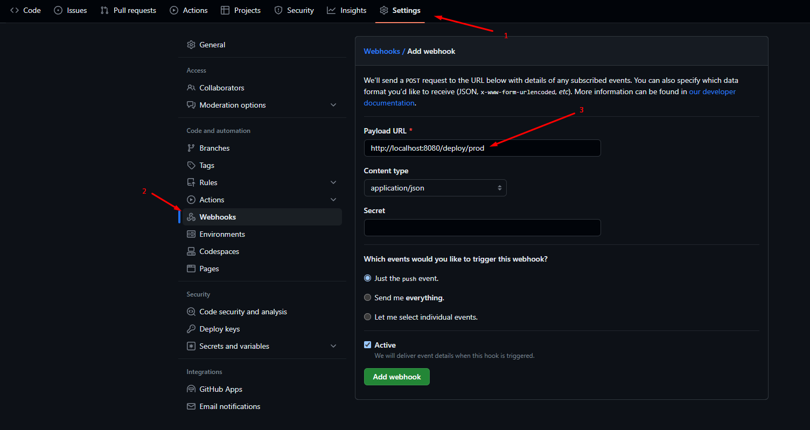

# Nodejs/Express CD with Github WebHook
 Simple solution for continuous deployment of a nodejs/express application using a github web hook

## How to use
To use this solusion you just have to create a `POST` end-point in your express routing like the following exemple:
```js
const express = require('express');
const { exec } = require('child_process');
const app = express();
const port = 8080;

app.post('/cd-deploy', (req, res) => {
    exec('sh ./cd-scripts/deploy.sh', (error, stdout, stderr) => {
        stdout ? console.log("stdout: ", stdout) : '';
        stderr ? console.log("stderr: ", stderr) : '';
        if (error !== null) {
            console.log(`exec error: ${error}`);
        }
    });
    res.send("Ok");
});

app.listen(port, () => {
    console.log("Server is runing on port " + port);
})
```

* `Note : ` as shown in the code above we use `child_process` to execute a shell script from a Nodejs process

Then you have to add you created end-point to your project repository on github as shown bellow:



### So after every push, gihub will send a POST request to the `/cd-deploy` end-point that you have created so it disoatches the deployment precess